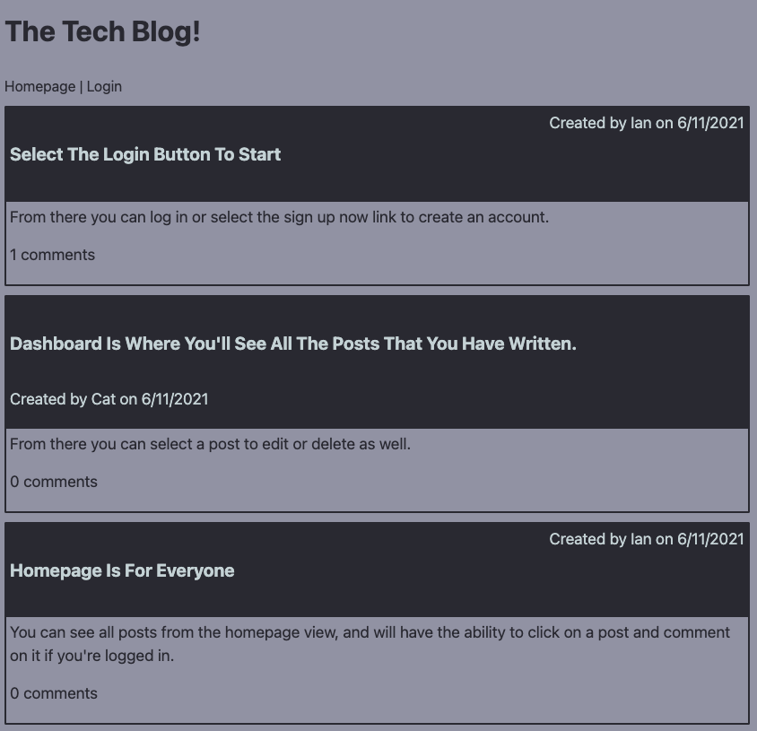
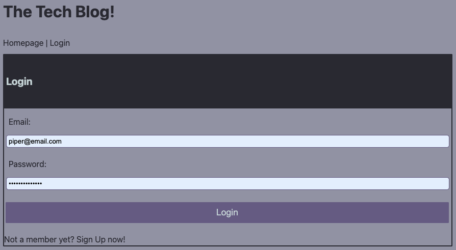
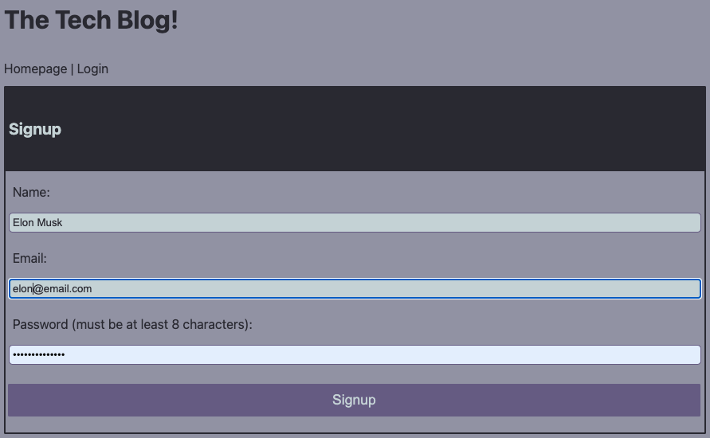
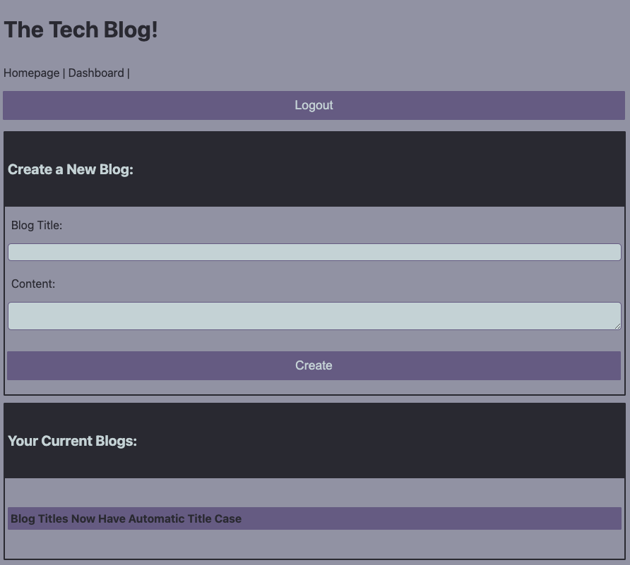
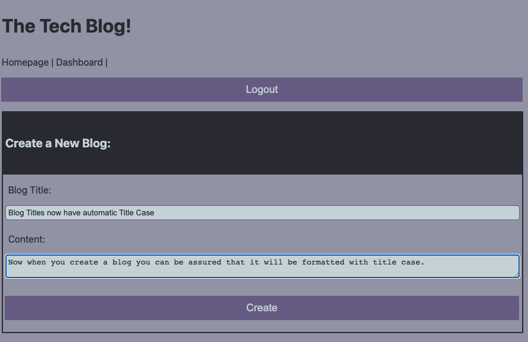
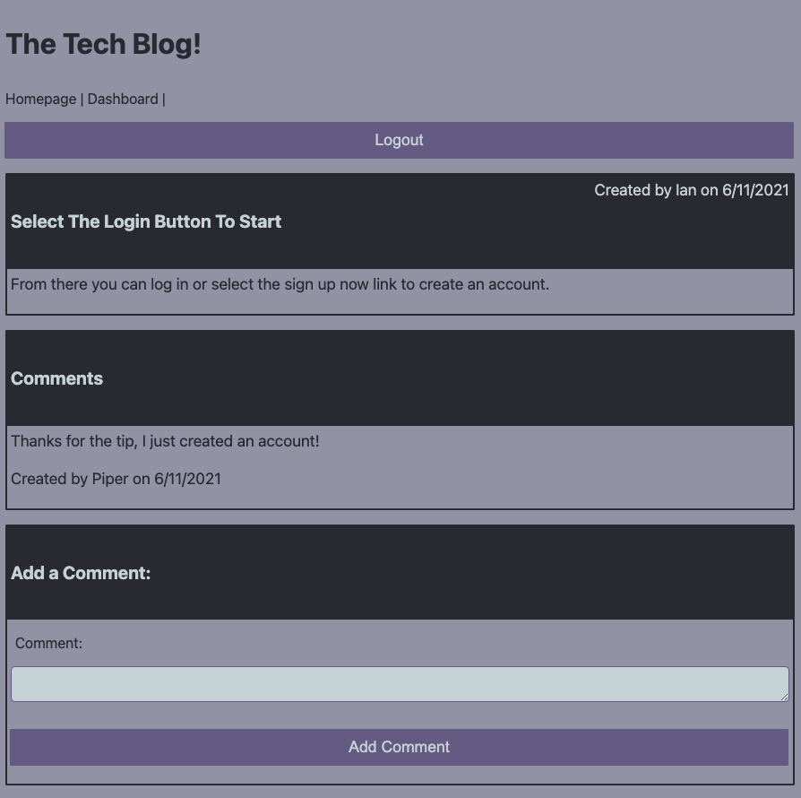
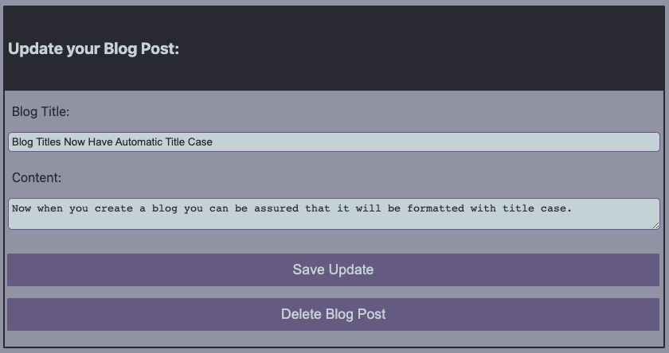

# tech-blog
A CMS-style blog site similar to a Wordpress site, where developers can publish their blog posts and comment on other developers’ posts as well. 

## Description & LIVE DEPLOYED WEBSITE
---
The app can be viewed live [here](https://tech-blog-ormerod.herokuapp.com/).  For more information see below.  

## Screenshots
---
The following images show the web application's appearance and functionality: 
The homepage, before you log in

The Login page if you already have an account

The Signup Page should you wish to create an account

The Dashboard, this only shows once logged in.  Note the appearance of the logout button.

The New Blog create page

Page showing a single blog post, with the existing comments, and ability to add comment if you're logged in.

Update Blog page where you can update the content, or alternatively delete the post. 

## Tools & Technologies
---
    - mysql
    - express
    - sequalize
    - dotenv to hide personal data
    - handlebars with handlebars helpers
        - for this i utilised a date format, as well as a format text helper to ensure that the casing was consistent.
    - used a maxAge on the cookies to ensure that the user was logged out after 10 mins
    - bcrypt - used in conjuction with 'withAuth' to ensure the user password was secure, and that they only saw sections of the website whilst logged in.

## Installation
---
Step 1 - Clone the github repo

Step 2 - Enter your details in the EXAMPLE .env file and save as .env

Step 3 - Right click the server.js file and `Open in intergrated Terminal`, and run `npm i` to install dependancies

Step 4 - Enter `mysql -u <username> -p` in terminal (this will open sql shell)

Step 5 - Enter your password

Step 6 - Enter `source db/schema.sql`, once this has run enter `quit` to exit the shell

Step 7 - Enter `npm run seed` to seed the test data into the database

Step 8 - Enter `npm start` to open the server connection

Step 9 - Open your browser and enter`localhost:3001/`

## Questions?
---
If you have any questions about this project, please contact me directly on [email](mailto:catormerod@gmail.com). You can view more of my projects at [Github](https://github.com/catormerod) or this specific project at [tech-blog](https://github.com/CatOrmerod/tech-blog). 

The app can be viewed live [here](https://tech-blog-ormerod.herokuapp.com/). 
